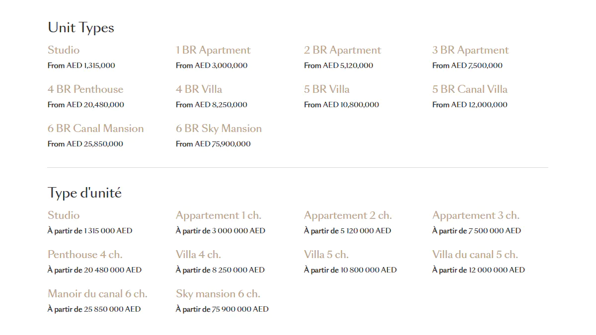
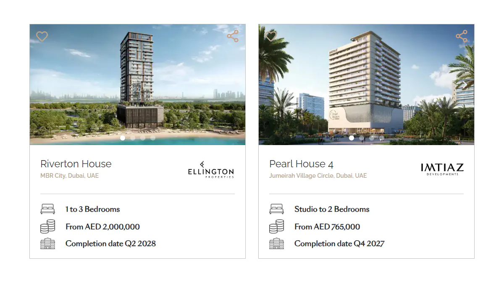
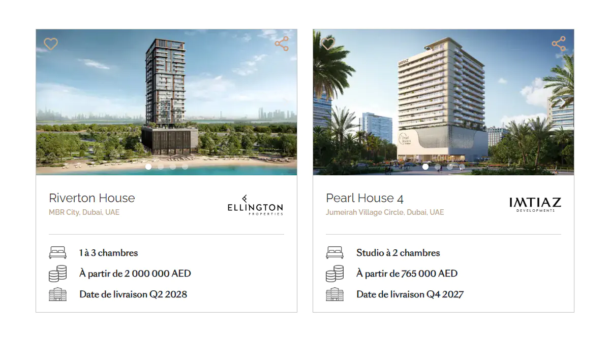

# Real Estate Units

A set of WordPress shortcodes for displaying real-estate units,
built around a standardized and maintainable unit title generation system.

## Preview

**Units and Prices**

<kbd>
  
</kbd>

&nbsp;

**Property Cards (English)**

<kbd>
  
</kbd>

&nbsp;

**Property Cards (French)**

<kbd>
  
</kbd>

## Features

* Standardized unit title generation
* Multilingual template tags
* Unit price display
* Lowest unit price calculation
* Bedroom range determination

## How to Set Up Backend

In JetEngine, create a CPT and add a repeater field: `property_units`.

The repeater contains the following fields:

**1. unit_bedroom_count** — `select`

* 0 Bedrooms (Studio) — `0`
* 1 Bedroom — `1`
* 2 Bedrooms — `2`
* 3 Bedrooms — `3`

**2. unit_type** — `select`

* Studio — `0`
* Apartment — `1`
* Penthouse — `2`
* Townhouse — `3`
* Villa — `4`

**3. unit_layout** — `select`

* Standard — `1`
* Duplex — `2`
* Triplex — `3`

**4. unit_price** — `number`

* Minimum value: `0`
* `0` means price is unknown

**5. unit_type_template** — `text`

* A field used to build custom unit names using template placeholders
* Supports: `{br}`, `{layout}`, `{type}`, `{join}`, `{maid}`, `{study}`, `{pool}`, `{!...}`

## How to Use

Copy any of the available shortcode functions
into your theme's `functions.php` file or a custom plugin.

Insert any of the available shortcodes where needed:

* `[units_and_prices]` — displays unit titles and prices
* `[lowest_unit_price]` — displays the lowest available unit price
* `[bedroom_range]` — displays the available bedroom range

## Examples

### Standard Units

The majority of unit titles can be generated using only
the `unit_bedroom_count` and `unit_type` select fields.

| English        | French                |
|----------------|-----------------------|
| Studio         | Studio                |
| 1 BR Apartment | Appartement 1 ch.     |
| 2 BR Penthouse | Penthouse 2 ch.       |
| 3 BR Townhouse | Maison de ville 3 ch. |
| 4 BR Villa     | Villa 4 ch.           |

### Duplex and Triplex Units

For units with complex layouts, use the `unit_layout` select field 
in combination with `unit_bedroom_count` and `unit_type`.

**Note:** For Duplex and Triplex layouts, the Apartment type is automatically omitted
from the generated title. The same applies to French titles.

| English                | French                        |
|------------------------|-------------------------------|
| 2 BR Duplex            | Duplex 2 ch.                  |
| 3 BR Duplex Penthouse  | Penthouse duplex 3 ch.        |
| 4 BR Triplex Townhouse | Maison de ville triplex 4 ch. |
| 5 BR Triplex Villa     | Villa triplex 5 ch.           |

### Custom Units

For custom unit titles, use the `unit_type_template` text field.

First, define all available information about the unit using the select fields.

Then, reference this information using template placeholders:

* `{br}` — bedroom count
* `{layout}` — unit layout
* `{type}` — unit type

Additionally, the following attribute placeholders are available by default:

* `{join}` — attribute separator, currently `+`
* `{maid}` — maid room
* `{study}` — study
* `{pool}` — pool

**Note:** Template placeholders are language-agnostic,
meaning the same placeholders produce different output depending on the language.

| Unit                               | Template                     |
|------------------------------------|------------------------------|
| 2 BR Apartment + Maid              | `{br} {type} {join} {maid}`  |
| Appartement 2 ch. + ch. de service | `{type} {br} {join} {maid}`  |
| 3 BR Townhouse + Study             | `{br} {type} {join} {study}` |
| Maison de ville 3 ch. + bureau     | `{type} {br} {join} {study}` |
| 4 BR Penthouse + Pool              | `{br} {type} {join} {pool}`  |
| Penthouse 4 ch. + piscine          | `{type} {br} {join} {pool}`  |

### Branded Custom Units

If a unit contains branded or custom naming elements, include them as plain text in the template.

**Note:** The order of elements is flexible and can be adapted per language or design requirements.

| Unit                        | Template                    |
|-----------------------------|-----------------------------|
| 1 BR Signature Apartment    | `{br} Signature {type}`     |
| Appartement signature 1 ch. | `{type} signature {br}`     |
| 3 BR Garden Villa           | `{br} Garden {type}`        |
| Villa avec jardin 3 ch.     | `{type} avec jardin {br}`   |
| 5 BR Triplex Sky Mansion    | `{br} {layout} Sky Mansion` |
| Sky mansion triplex 5 ch.   | `Sky mansion {layout} {br}` |

### French Letter Case

French titles are normalized to sentence case, meaning only the first letter of the title
is uppercase and the rest is lowercase.

If a part of the title must preserve its original casing, use the `{!...}` placeholder.

| French               | Template            |
|----------------------|---------------------|
| Appartement 2 ch. XL | `{type} {br} {!XL}` |